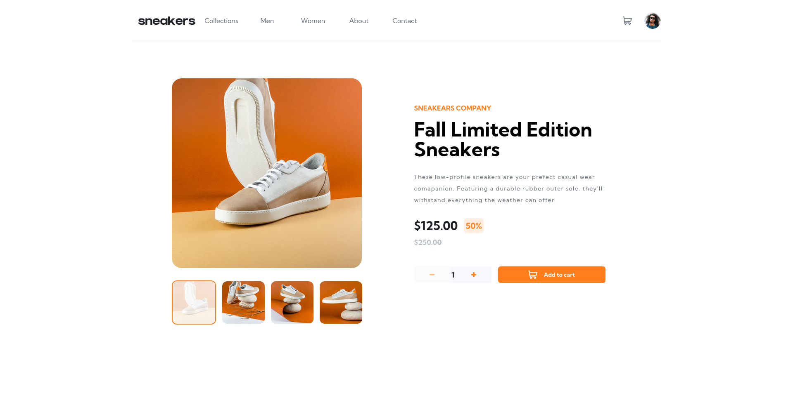

#  E-commerce product page

## Table of contents

- [Overview](#overview)
  - [The challenge](#the-challenge)
  - [Screenshot](#screenshot)
  - [Links](#links)
- [My process](#my-process)
  - [Built with](#built-with)
  - [Useful resources](#useful-resources)
- [Author](#author)
- [Acknowledgments](#acknowledgments)

## Overview

### The challenge

Users should be able to:

- View the optimal layout for the site depending on their device's screen size
- See hover states for all interactive elements on the page
- Open a lightbox gallery by clicking on the large product image
- Switch the large product image by clicking on the small thumbnail images
- Add items to the cart
- View the cart and remove items from it

### Screenshot

### Links

- Solution URL: [Github](https://github.com/ciarardm03/Ecommerce-FM)
- Live Site URL: [ecommerce-product-page](https://crdm-ecommerce-product-page.vercel.app/)

## My process

### Built with

- Semantic HTML5 markup
- CSS custom properties
- Flexbox
- CSS Grid
- Mobile-first workflow
- Tailwind
- [React](https://reactjs.org/) - JS library
- [Typescript](https://www.typescriptlang.org/)
- [Styled Components](https://ui.shadcn.com/) - For styles

### Useful resources

- [shadcn/ui](https://ui.shadcn.com/) - This helped me for having a pre-made components.
- [Tailwind Cheat sheet](https://tailwindcomponents.com/cheatsheet/) - This helped me easily find the class I used and it's value. I'd recommend it to anyone still learning this concept.

## Author

- Frontend Mentor - [@ciarardm03](https://www.frontendmentor.io/profile/ciarardm03)

## Acknowledgments

Credits to Renzo Angelo Decena
